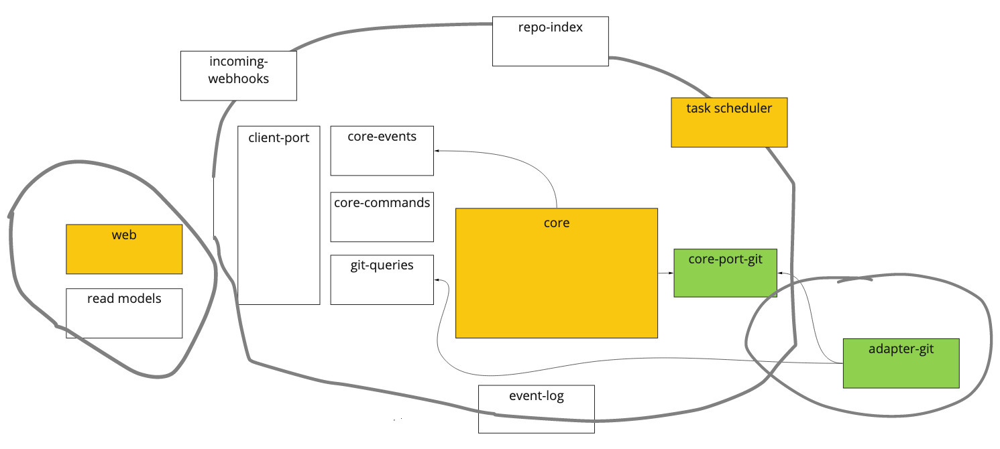

# 8. Hexagonal architecture / CQRS

Date: 2020-05-20

## Status

Accepted

## Context

We have just enough features in the repo to see the shape it will need to take.

## Decision

We'll aim our refactoring towards a hexagonal architecture, using commands and events as the way to communicate with the core domain.

Something like this:

Key to the diagram:

- Each box represents at least one yarn/npm package.
- Arrows, where drawn, indicate a dependency.
- Green indicates where we've already created and are building this package.
- Amber indicates where we have code for this, but it still needs to be factored out into this design.
- Hand-drawn lines indicate a bounded context.

Other agreements:

- Communication into / out of the core domain will be via commands and domain events.
- Commands going into the domain will all be asynchronous. The application layer (client port) can abstract this away by watching for domain events that indicate when the command has completed.
- We won't use event sourcing for the domain models, but we will probably persist domain events in a log.
- The client port will mediate queries to go straight into git, e.g. for streams of files.
- The web may keep its own cache of read models, shaped in the representation needed for its API. Hence the separate bounded context.

## Consequences

This design enables us to handle known and anticipated future requirements cleanly and quickly.

We will need time to move the existing code into this design before we're ready to absorb new features.

We still need to figure out:

- How to shape the abstraction around the task scheduler - use a specific port? Or just build someting around the events?
- RepoIndex is currently based on folders on disk. Need to move to postgres.
- Incoming webhooks port still to do. Not so much pull for this yet.
- How to model the asynchronous behaviour of the commands - repos will go through different states, and we need to model this.
- Tracking the completion of a command. Return a `commandId` to the client, that's mentioned in events, maybe?
